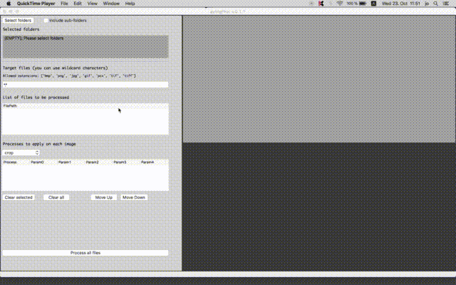

# pyImgProc



Utility program in Python to process multiple files with multiple image processing functions.
Functions currently include crop, masking, resize, rotate, flip, brighten, darken and writing a line of text.

Jinook Oh, Cognitive Biology department, University of Vienna<br>
Contact: jinook0707@gmail.com, tecumseh.fitch@univie.ac.at<br>
September 2019.

## Dependency:
- **Python** (3.7)
- **wxPython** (4.0)
- **numPy** (1.15)
- **Pillow** (6.1)

## Masking
Masking function uses *mask.png* file, which currently has simple circle shape.
Edit this image to change masking shape.

## To add a function
1) Add an item in list, self.imgProcOptions.<br>
  e.g.: 'flip'
2) Add matching keyword and a list in dictionary, self.ipParams.<br>
  e.g.: flip=['direction']
3) Add matching keyword and a list in dictionary, self.ipParamDesc.<br>
  e.g.: flip=['direction (0-2; 0:horizontal, 1:vertical, 2:both)']
4) Add matching keyword and a list in dictionary, self.ipParamVal.<br>
  e.g.: flip=[0]
5) Insert code for the function in a function called 'procImg'.<br>
  e.g.:
  ```
  elif pn == 'flip':
    direction = self.ipParamVal[pn][0]
    img = Image.fromarray(img)
    ### 0:Image.FLIP_LEFT_RIGHT, 1:Image.FLIP_TOP_BOTTOM
    if direction == 2:
        img = img.transpose(0)
        img = img.transpose(1)
    else:
        img = img.transpose(direction)
    img = np.array(img)
  ```

